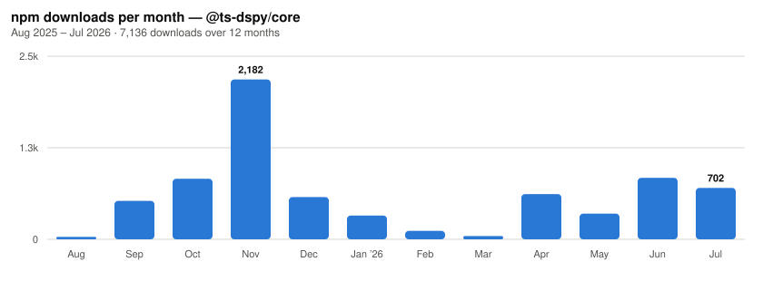

# TS-DSPy

[](https://github.com/ardada2468/LLMTypeSafe/actions/workflows/ci.yml)
[](https://www.npmjs.com/package/@ts-dspy/core)
[](https://www.npmjs.com/package/@ts-dspy/core)
[](https://nodejs.org)
[](LICENSE)

**Type-safe LLM output for TypeScript.** Declare the shape you want back, and get
it — checked at runtime, not just asserted by the compiler.

📖 **[Documentation](https://ardada2468.github.io/LLMTypeSafe/)** &nbsp;·&nbsp;
[Examples](https://ardada2468.github.io/LLMTypeSafe/examples.html) &nbsp;·&nbsp;
[Architecture](https://ardada2468.github.io/LLMTypeSafe/architecture.html)

---

## The problem

Every LLM library will hand you an object typed the way you asked. Almost none
check that the model actually complied.

```ts
const { score } = await predict({ question });

// TypeScript says: number
// Actually holds: "high"
score.toFixed(2); // 💥 throws, three files away from the cause
```

The type was a claim, not a guarantee. The failure surfaces somewhere else
entirely — a chart, a sum, a database write — long after the reply that caused it.

## The fix

TS-DSPy validates the reply against your signature before it reaches you.

```ts
try {
  const { score } = await predict({ question });
  // score really is a number here.
} catch (err) {
  if (err instanceof ValidationError) {
    err.issues; // [{ field: 'score', expected: 'number', received: 'high' }]
    err.rawOutput; // exactly what the model said
  }
}
```

Coercion stays lenient, because models emit text — `"42"`, `"1,200"` and `"87%"`
all satisfy a `number`. What is no longer lenient is failure.

---

## Install

```bash
npm install @ts-dspy/core @ts-dspy/anthropic   # or /openai, or /gemini
```

Requires **Node.js 22+**. Ships ESM and CommonJS with types for both.

## Quick start

```ts
import { Signature, InputField, OutputField, Predict, configure } from '@ts-dspy/core';
import { AnthropicLM } from '@ts-dspy/anthropic';

configure({ lm: new AnthropicLM({ apiKey: process.env.ANTHROPIC_API_KEY }) });

class TriageTicket extends Signature {
  static description = 'Classify a support ticket and rate its urgency.';

  @InputField({ description: 'the ticket body' })
  ticket!: string;

  @OutputField({ description: 'billing | bug | feature | other' })
  category!: string;

  @OutputField({ description: 'urgency from 0 to 1', type: 'number' })
  urgency!: number;
}

const { category, urgency } = await new Predict(TriageTicket).forward({ ticket });

if (urgency > 0.8) escalate(category); // urgency is a number, or this threw
```

Prefer no decorators? String signatures work too:

```ts
const qa = new Predict('question -> answer, confidence: number');
```

<details>
<summary><strong>tsconfig for the decorator form</strong></summary>

```json
{
  "compilerOptions": {
    "experimentalDecorators": true,
    "useDefineForClassFields": false
  }
}
```

`useDefineForClassFields` **must** be `false`. At an `ES2022` target it defaults
to `true`, which makes class fields overwrite what the decorators recorded and
leaves your signature with no fields at all.

</details>

---

## Packages

| Package                                    | Model default      |                                                                        |
| ------------------------------------------ | ------------------ | ---------------------------------------------------------------------- |
| [`@ts-dspy/core`](packages/core)           | —                  | Signatures, modules, validation. Depends on zod alone — no vendor SDK. |
| [`@ts-dspy/anthropic`](packages/anthropic) | `claude-opus-5`    | Structured outputs, streaming, refusals as typed errors                |
| [`@ts-dspy/openai`](packages/openai)       | `gpt-5.2`          | Official SDK, any OpenAI-compatible `baseURL`                          |
| [`@ts-dspy/gemini`](packages/gemini)       | `gemini-3.5-flash` | Built on `@google/genai`, Vertex AI support                            |

Signatures and modules name no vendor, so the provider is a runtime choice —
which is also how you run one evaluation across three models.

## What you get

|                        |                                                                                                                                                |
| ---------------------- | ---------------------------------------------------------------------------------------------------------------------------------------------- |
| **Signatures**         | Declare inputs and outputs as a class or a string. One declaration drives the prompt, the JSON Schema sent to the provider, and the validator. |
| **Modules**            | `Predict` asks once. `ChainOfThought` reasons first. `RespAct` runs a tool loop.                                                               |
| **Validation**         | Every reply checked against the declared types. `ValidationError` names the field and carries the raw output.                                  |
| **Structured outputs** | Uses each provider's native JSON-schema mode when it has one, falling back to labelled-text parsing when it doesn't.                           |
| **Streaming**          | All three providers, via the SDK.                                                                                                              |
| **Timeouts & retries** | Passed through to the provider SDK, which honours `retry-after`. No competing retry loop here.                                                 |

## Output types

| Type               | Accepts                          | Rejects          |
| ------------------ | -------------------------------- | ---------------- |
| `string`           | any text (default)               | —                |
| `number` `float`   | `42`, `"42"`, `"1,200"`, `"87%"` | `"about forty"`  |
| `int` `integer`    | `7`, `"7"`                       | `"7.5"`          |
| `boolean` `bool`   | `true`, `"true"`, `"yes"`, `"1"` | `"maybe"`        |
| `string[]` `array` | JSON arrays, or `"a, b, c"`      | unparseable text |
| `object` `json`    | JSON objects, fenced or bare     | invalid JSON     |

Mark a field `required: false` and it becomes optional in both the schema and the
inferred TypeScript type.

## Downloads

[](https://www.npmjs.com/package/@ts-dspy/core)



Regenerated monthly from the
[public npm downloads API](https://github.com/npm/registry/blob/main/docs/download-counts.md)
by [`npm-downloads-chart.yml`](.github/workflows/npm-downloads-chart.yml).

---

## Examples

Runnable programs live in [`examples/`](examples). They read the API key from the
environment and fail with a clear message when it is missing.

```bash
ANTHROPIC_API_KEY=... npm run example:anthropic
OPENAI_API_KEY=...    npm run example:openai
GEMINI_API_KEY=...    npm run example:gemini
```

Nine worked examples — classification, extraction, tool loops, error handling,
testing — are on the [examples page](https://ardada2468.github.io/LLMTypeSafe/examples.html).

## Development

```bash
npm install
npm run build              # tsup, core first — providers need its types
npm test                   # vitest
npm run lint
npm run typecheck          # packages and examples
npm run verify:packaging   # pack, install, and import as a real consumer would
```

Every one of these runs in CI on each pull request across Node 22, 24, and 26,
and the release workflow runs the same set before it can publish.

`verify:packaging` is the one worth knowing about: it packs the tarballs,
installs them into a throwaway project, and imports them from both ESM and
CommonJS. Builds, type checks, and unit tests all run against workspace symlinks,
so none of them can see a wrong dependency range — which is how 0.4.2 shipped
providers depending on a core version that release did not satisfy.

Releases run on [changesets](https://github.com/changesets/changesets): add one
with `npx changeset` when you change a published package, or `npx changeset
--empty` for a change that ships no release. Publishing uses npm trusted
publishing, so there is no token to rotate — see [RELEASING.md](RELEASING.md).

## Credits

Inspired by [DSPy](https://github.com/stanfordnlp/dspy) from Stanford NLP.

## License

MIT — see [LICENSE](LICENSE).
